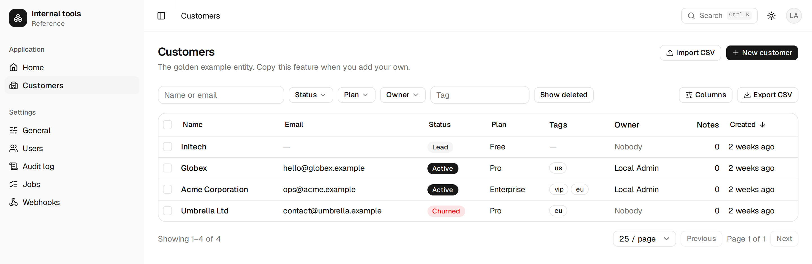

# Internal tools reference

A template for building internal tools at startups. Clone it, rename the golden
example entities, and most of what an internal tool needs is already there: SSO
login, roles and permissions, tables and forms with validation, audit history,
background jobs and schedules, file uploads, email and Slack, settings and feature
flags, structured logging, and a UI shell.

Status: all seven phases of `docs/BUILD_PLAN.md` implemented. 120 unit and API tests,
32 end-to-end tests, all green against Postgres. No tool has been built on it yet —
the golden example works, but the seams have not been pulled on by a real project.



Stack in one line: TypeScript, React with Vite, Hono, Postgres with Drizzle,
shadcn/ui on Tailwind 4, one Docker image that runs anywhere.

## Quick start

Requires Node 22 and Docker.

```bash
cp .env.example .env
docker compose up -d postgres      # Postgres on localhost:5439, databases app and app_test
npm install
npm run db:migrate
npm run db:seed                    # creates admin@local.test for dev login
npm run dev                        # API on :3000, client on :5174
```

Open http://localhost:5174 and use the development login with `admin@local.test`.

## Everyday commands

| Command | Does |
|---|---|
| `npm run check` | typecheck, lint, unit and API tests (needs Postgres) |
| `npm run build` | client to `dist/client`, server to `dist/server/main.js` |
| `npm start` | run the built app (`APP_MODE` = `web`, `worker` or `all`) |
| `npm run test:e2e` | Playwright against the built app on :3100 |
| `npm run db:generate` | generate a migration from table changes |
| `npm run db:reset` | development only: drop, migrate, seed (asks first) |
| `docker compose up -d` | production-like: Postgres plus the app image on :3000 |

## Starting a real tool

Follow `docs/recipes/start-a-tool.md`: rename, add your first entity with
`docs/recipes/add-entity.md`, then delete the `customers` and `notes` examples. Set up
SSO, notifications and storage from `docs/CONFIG.md`, deploy the one image.

## What has and has not been verified

Verified in this repository: every block's unit and API tests against Postgres, the
Playwright suite against the built server and (in CI) against the Docker image, the
queue's claim exclusivity and scheduler under concurrent workers. The S3 storage driver
was round-tripped against MinIO by hand once; there is no automated test for it.
`docs/ACCEPTANCE.md` lists, per block, what has evidence and what does not.

Not yet verified anywhere: sign-in against a real Google or Microsoft tenant (tests use a
fake OpenID Connect provider with locally signed tokens), the SMTP driver against a real
mail server, the S3 driver against AWS or Cloudflare R2. Do these on your first staging
deployment before inviting users.

## Documentation

- `docs/ARCHITECTURE.md`: start here.
- `docs/BUILD_PLAN.md`: what gets built in which order, with acceptance criteria.
- `docs/blocks/`: the spec per building block.
- `docs/recipes/`: how to start a tool, add an entity, a job, an integration or a setting.
- `docs/adr/`: why things are the way they are.
- `docs/CONFIG.md`: every environment variable.
- `docs/SECURITY.md`: security invariants, the review findings, what is not verified.
- `docs/ACCEPTANCE.md`: per block, what has a test, what was checked by hand, what is not verified.
- `CLAUDE.md`: the rule book for changing the repo.

## Contributing and licence

Bug reports and documentation fixes are welcome; see `CONTRIBUTING.md` for what is worth
sending back to a template you are meant to fork. Security issues go through a private
advisory, not a public issue — `SECURITY.md`.

MIT licensed. Do what you like with it.
